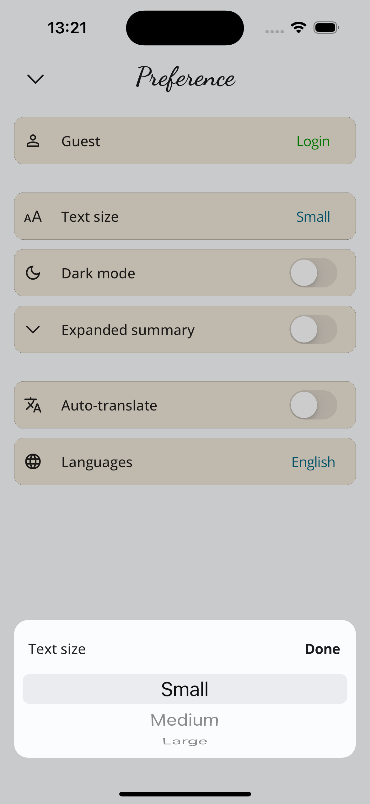

# News_app

This is News App - build by Flutter (Bloc).
I have build an app for news-reader with a nice and user friendly UX/UI. Support translate to vietnamese upto now. Support multi-news-sources / languages. AI summaries news content with a text-to-speech button.

---

Features:

- Responsive App.
- Managing States. (Bloc)
- Fetching News. (NewsAPI)
- Translate to a specific language. (Google Translate API)
- Authentication, login, logout. (Firebase)
- Saving local data. (SharedPreference)
- Saving big local data. (Hive - in progress)

Technologies:

- Bloc - state management.
- Http - fetching data / translate content.
- Firebase - authentication, storage.
- Hive - saving local data.

---

Views:
There are 5 main screens:

Main Page:

- AppBar: with a Settings button and a Bookmarks button.
- Content View: showing News in types of list. (Tap to view detail).
- Floating Button:
  - Filter Button: showing current news filter. (Tap to navigate to filter page)
  - Go to top button.

Bookmarks Page:

- AppBar: Back_To_Main_Page Button.
- Content View: showing News in types of list. (Tap to view detail).

Settings Page:

- AppBar: Back_To_Main_Page Button.
- Information View with Login/ Logout button.
- Text Size with a picker-opener button : choosing text size.
- Darkmode with switcher: change the theme of app depends on Device's Theme.
- Expanded summary with switcher: auto expanded summary view in Detail Screen.
- Auto-translate with switcher: auto translate detail content to vietnamese.
- Languages with a picker-opener button : choosing a language for the app.

Detail Page:

- AppBar:
  - Back_To_Main_Page Button.
  - Share button.
  - Open News' link in browser.
  - Add to Bookmark Button.
  - Translate button.
- Content View: showing a thumbnail / AI Summary View / News Content.
- Button at the end of content view:
  - Back_To_Main_Page Button.
  - Share button.
  - Open News' link in browser.
- Floating button:
  - Audio button: content's text to speech.
  - To top button.

Filter Page:

- Search bar: searching for a category or page.
- by Categories / by Pages : showing selections for user to choose one for filtering the news' source.

---

Pics

       
